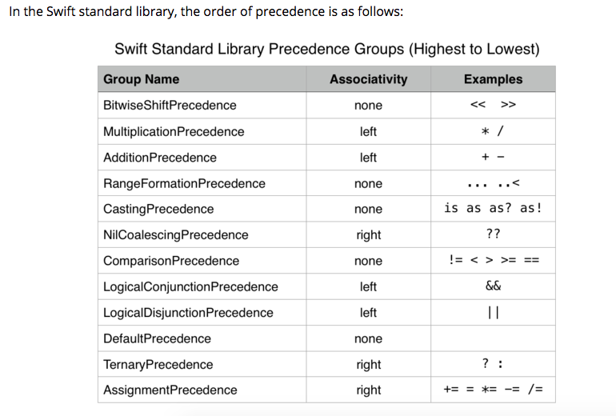
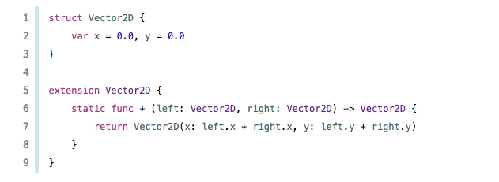
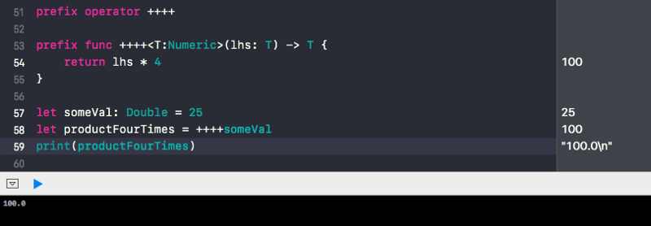

**`Swift` 里的操作符分成以下几种：**

* 中缀：用在两个值之间（ex：`value` + `value`）
* 前缀：用在一个值前面（ex: !`value`）
* 后缀：用在一个值后面（ex: `value`!）
* 三元运算符：两个符号插入在三个之间（ex：`value1` ? `value2` : `value3`）到目前为止，我们不能创建自定义三元操作符，Swift 不允许开发者这样做。

**如何创建自定义操作符**

我们想创造一个操作符：使用 `√` 符号计算一个数的平方根。像下面的代码这样：

```swift
let someVal = 25
let squareRoot = √someVal  //resultis 5
```

**第一步：**


- 声明符号 `√` 作为前缀操作符。

```swift
prefix operator √
```

**第二步：**


- 创建一个接受一个参数并且开平方根的函数。

```swift
prefix func √(lhs: Double) -> Double {
    return sqrt(lhs)
}
```

**用 ◉ 符号创建一个中缀操作符**

这个 ◉ 符号函数接受不了两个参数 `lhs` 和 `rhs`，并且返回它们的平方和。

- 声明 ◉ 符号作为中缀操作符。

```swift
infix operator ◉
```

- 创造一个接受两个参数并执行上面操作的函数。

```swift
infix func ◉(lhs: Double, rhs: Double) -> Double {
    return lhs * lhs + rhs * rhs
}
```

如果你这么做了，编译器会：

```
error: MyPlayground.playground:14:1: error: ‘infix’ modifier is not required or allowed on func declarations
```

移除 `infix` 关键字，重写函数。

```swift
func ◉(lhs: Double, rhs: Double) -> Double {
    return lhs * lhs + rhs * rhs
}
```

Q：当我们创建一个自定义操作符时，是不是忘记考虑一些事情？

A：是的，我们忘了操作符的优先级（precedence）


在数学和大多数计算机语言中，乘法被赋予比加法更高的优先级。因此，这个表达式 `2+3x4` 被解释为这个值 `2+(3x4)=14`，而不是 `(2+3)x4=20`。在创建自定义操作符时，我们还必须考虑这一点。操作符的优先级是一个重要因素。

**优先级和结合性**

Apple 文档在[这](https://developer.apple.com/library/content/documentation/Swift/Conceptual/Swift_Programming_Language/AdvancedOperators.html#//apple_ref/doc/uid/TP40014097-CH27-ID41)

运算符优先级(`Operator precedence`)赋予某些运算符比其他运算符更高的优先级(priority);首先应用这些操作符。

操作符关联性(`Operator associativity`)定义了如何将具有相同优先级的操作符分组在一起，或者从左边分组，或者从右边分组。可以把它理解为它们与左边的表达式相关联，或者它们与右边的表达式相关联。

解析具有左结合律的类型，使 `v1 + v2 + v3 == (v1 + v2) + v3`。右结合律则相反。

如果您声明一个新的操作符而没有指定优先组(`precedence group`)，那么它就属于`Defaultpriority`优先组(`DefaultPrecedence precedence group`)。`Defaultpriority`没有关联(`associativity`)，它的优先级(`precedence`)直接高于`Ternarypriority`。



创造我们自己的中缀操作符：

- 创建一个名为 `squaresumoperatorpriority` 的优先组。

```swift
precedencegroup SquareSumOperatorPrecedence {
    lowerThan: MultiplicationPrecedence
    higherThan: AdditionPrecedence
    associativity: left
    assignment: false
}
```

在这里，我们创建了一个优先级组，它的优先级高于加法优先级，低于乘法优先级和左结合性。

- 现在用以下代码替换操作符的原始声明.

```swift
infix operator ◉: SquareSumOperatorPrecedence
```


**注**
- 了解操作符重载。类和结构可以提供它们自己的现有操作符实现。这称为重载现有操作符。例如:==，+等。



- 了解有关向自定义操作符添加泛型类型约束的更多信息



---
**参考资料：**
- [How to create a custom operator (like ~= operator) in swift ?? ](https://medium.com/@abhimuralidharan/how-to-create-a-custom-operator-like-operator-in-swift-55953c0c0bf2)
- [Basic Operators — The Swift Programming Language (Swift 5)](https://docs.swift.org/swift-book/LanguageGuide/BasicOperators.html)
- [Advanced Operators — The Swift Programming Language (Swift 5)](https://docs.swift.org/swift-book/LanguageGuide/AdvancedOperators.html)
- [基本运算符 - SwiftGG](https://swiftgg.gitbook.io/swift/swift-jiao-cheng/02_basic_operators)
- [高级运算符 - SwiftGG](https://swiftgg.gitbook.io/swift/swift-jiao-cheng/26_advanced_operators)
- [Order of operations - Wikipedia](https://en.wikipedia.org/wiki/Order_of_operations)
- [Operator Declarations - Apple Developer Documentation](https://developer.apple.com/documentation/swift/swift_standard_library/operator_declarations)