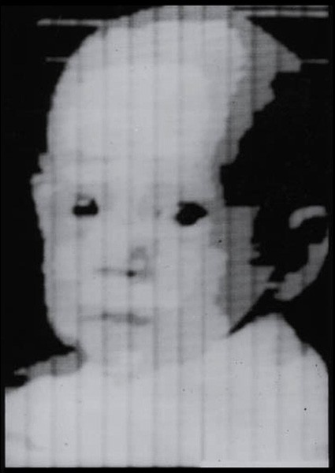

# 计算机视觉（及卷积神经网络）简史

> 本文为 AI 研习社编译的技术博客 原标题 ：A Brief History of Computer Vision (and Convolutional Neural Networks) 作者 | Rostyslav Demush 翻译 | 鳄鱼艾德克、小先生爱你  校对 | 酱番梨 审核 | 约翰逊·李加薪 整理 | 立鱼王 原文链接：https://hackernoon.com/a-brief-history-of-computer-vision-and-convolutional-neural-networks-8fe8aacc79f3  译文链接：https://ai.yanxishe.com/page/TextTranslation/1518  公众号文章链接：https://mp.weixin.qq.com/s/ib5nIY_kq4nTAMsex9SKkA

    

尽管计算机视觉近期突然兴起（重大突破时刻发生在2012年，那时AlexNet网络赢得ImageNet的冠军），它确实不是以一个新的科学领域。

世界范围内的计算机方面的科学家在过去的六十年一直尝试寻找使得机器能够在视觉数据中提取出含义，计算机视觉的历史是非常令人着迷的，这个方面是大多数人所不了解的。

在这篇文章中，我将会尝试介绍现代计算机视觉系统是如何通过卷积神经网络驱动的。

我将会从一个二十世纪五十年代出现的，和软件工程毫不相关的作品开始。

计算机视觉中最有影响力的论文之一由两位神经生理学家 David Hubel和Torsten Wiesel 于1959年发表。他们的出版物题为“猫的纹状皮层中单个神经元的感受野”，描述了视觉皮层神经元的核心反应特性。以及猫的视觉体验如何塑造其皮质结构。

两人进行了一些非常精细的实验。他们将电极放入麻醉猫脑的初级视皮层区域，观察或至少试图在该区域进行神经元活动，同时向动物展示各种图像。他们的第一次努力没有结果——他们无法让神经细胞对任何事情做出反应。

然而，在研究的几个月后，他们注意到，一个神经元在他们将一个新的幻灯片滑入投影机时被发射，而不是偶然。这是一次幸运的意外。经过一些初步的混淆，Hubel 和 Wiesel 意识到让神经元兴奋的是由玻璃片的锋利边缘的阴影所产生的线条的运动。

    

研究人员通过实验发现初级视觉皮层含有许多简单和复杂的神经元，并且视觉处理过程总是从类似特定方向边缘的这类简单结构开始。

听起来是不是挺熟悉？这就是隐藏于深度学习之后的核心准则。

计算机视觉历史中下一个值得关注的是第一台数字图像扫描仪的发明。

在1959年，Russell 和他的同学研制了一台可以把图片转化为被二进制机器所理解的灰度值的仪器。正是由于他们的成果，我们现在能够用不同的方法处理数字图像。

第一张被数字扫描的图片是Russell的婴儿照。它仅仅是一副 5cm * 5cm 的关于 30976(176 * 176)个像素所构成的图片，但它变得举世闻名是因为原始图片被保存在波特兰艺术博物馆。

    

接下来讨论 Lawrence Roberts 的“三维固体的机器感知”，这本在1963年出版的书被广泛认为是现代计算机视觉的前导之一。

在他的博士论文中，Larry描述了从二维图片中推导三维信息的过程。他把视觉世界所看到的简化为几何形状。

    

他在论文中描述和编写程序的目的是将二维图像处理成线条，然后利用这些线条建立起三维重示，最终显示物体移除了所有隐藏线条的三维结构。

在三维到二维展示之后，Larry 写下了二维到三维的构造是计算机辅助三维系统的一个良好开端，他完全正确。

我们应该注意到 Lawrence 并没有在计算机视觉这方面花费太多精力，相反他加入了 DARPA，现在以因特网发明被人所熟知的项目。

在1960s，AI 成为了一门学科，一些研究人员关于这块领域的未来非常乐观，他们相信用不了25年时间就能造出和人类一样智能的计算机。同一时期，MITAI实验室的 Seymour Papert 教授决定启动夏季视觉项目，并在几个月内解决机器视觉问题。

他认为一小群 MIT 的学生在夏天开发了视觉系统的重要组成部分。Seymour 和 Gerald Sussman 协调学生将设计一个可以自动执行背景/前景分割，并从真实世界的图像中提取非重叠物体的平台。

这个课题没有成功，50年之后，我们仍然在向解决计算机视觉前进。据许多人说，这个项目是计算机视觉作为一个科学领域的正式诞生的标志。

在1982年，一个英国神经学家 David Marr 发表了另一篇有影响的论文-“愿景：对人类表现和视觉信息处理的计算研究”。

基于 Hubel 和 Wiesel 的想法(他们发现视觉处理不是从整体对象开始),David 给了我们下一个重要的见解：他确定了这个愿景是等级的，视觉系统的主要功能是创建环境的3维表示，以便我们可以与之交互。

他介绍了一个视觉框架，其中检测边缘，曲线，角落等的低级算法被用作对视觉数据进行高级理解的铺垫。

David Marr 的视觉代表框架包括：

- 图像的原始草图，其中表示边缘，条形，边界等（这显然受到 Hubel 和 Wiesel 研究的启发）;

- 2½维的草图表示，其中表面，图像上的深度和不连续性信息拼接在一起;

- 根据曲面和体积基元分层组织的3维模型。

David Marr 的成果在当时是开创性的，但它非常抽象和高级。 它没有包含任何可以在人工视觉系统中使用的数学建模的信息，也没有提到任何类型的学习过程。

大约在同一时间，日本计算机科学家 Kunihiko Fukushima 也受到 Hubel 和 Wiesel 的启发，建立了一个自组织的简单和复杂细胞的人工网络，可以识别模式并且不受位置变化的影响。 网络 Neocognitron 包括几个卷积层（通常是矩形的），他的感受野具有权重向量（称为滤波器）。

这些滤波器的功能是在输入值的二维数组（例如图像像素）上滑动，并在执行某些计算后，产生激活事件（2维数组），这些事件将用作网络后续层的输入。

Fukushima 的 Neocognitron 可以说是第一个神经网络; 它是今天的神经网络的祖父。

几年后，在1989年，一位年轻的法国科学家 Yann LeCun 将一种后向传播风格学习算法应用于 Fukushima 的卷积神经网络结构。 在完成该项目几年后，LeCun 发布了 LeNet-5--这是第一个引入我们今天仍在 CNN 中使用的一些基本成分的现代网络。

在他面前的 Fukushima，LeCun 决定将他的发明应用于角色识别，甚至发布了用于阅读邮政编码的商业产品。

除此之外，他的工作创建手写数字的 MNIST 数据集 - 这可能是机器学习中最着名的基准数据集。

1997年，一位伯克利教授 Jitendra Malik（以及他的学生Jianbo Shi）发表了一篇论文，描述了他试图解决感性分组的问题。

研究人员试图让机器使用图论算法将图像分割成合理的部分（自动确定图像上的哪些像素属于一起，并将物体与周围环境区分开来）。

他们没有走得太远; 感知分组的问题仍然是计算机视觉专家正在努力解决的问题。

在1990s，计算机视觉作为一个领域，在很大程度上改变了它的关注点。

大约在1999年，许多研究人员停止尝试通过创建它们的3维模型（Marr提出的路径）来重建对象，而是将他们的努力转向基于特征的对象识别。 David Lowe 的作品“来自局部尺度不变特征的物体识别”特别表明了这一点。

文章描述了一种视觉识别系统，该系统使用对旋转，位置和部分照明变化不变的局部特征。 根据Lowe的说法，这些特征有点类似于在颞下皮层中发现的神经元的特性，这些特征涉及灵长类视觉中的物体检测过程。

不久之后，在2001年，Paul Viola 和 Michael Jones 推出了第一个实时工作的人脸检测框架。 虽然不是基于深度学习，但算法仍然具有深刻的学习风格，因为在处理图像时，它了解哪些特征（非常简单，类似Haar的特征）可以帮助定位面部。

    

Viola / Jones 面部探测器仍被广泛使用。 它是一个强大的二元分类器，由几个弱分类器构成; 在学习阶段，在这种情况下非常耗时，使用 Adaboost 训练弱级分类器的级联。

为了找到感兴趣的对象（面部），模型将输入图像分割成矩形块并将它们全部提交给弱检测器的级联。 如果补丁通过级联的每个阶段，则将其归类为正数，否则，算法会立即拒绝它。 该过程在各种规模上重复多次。

该论文发表五年后，Fujitsu 发布了一款具有实时人脸检测功能的相机，该功能依赖于Viola / Jones算法。

随着计算机视觉领域不断发展，社区迫切需要基准图像数据集和标准评估指标来比较其模型的性能。

2006年，Pascal VOC 项目启动。 它提供了用于对象分类的标准化数据集以及用于访问所述数据集和注释的一组工具。 创始人还在2006年至2012年期间举办了年度竞赛，该竞赛允许评估不同对象类识别方法的表现。

2009年，另一个重要的基于特征的模型由 Pedro Felzenszwalb，David McAllester 和 Deva Ramanan  - 可变形零件模型开发。

从本质上讲，它将对象分解为部分集合（基于 Fischler 和 Elschlager 在20世纪70年代引入的图像模型），在它们之间强制实施一组几何约束，并将被模拟的潜在对象中心视为潜在变量。

DPM 在对象检测任务（使用边界框用于本地化对象）和击败模板匹配以及当时流行的其他对象检测方法方面表现出色。

你可能听说过的 ImageNet 大规模视觉识别竞赛（ILSVRC）始于2010年。继 PASCAL VOC 之后，它也每年举办一次，包括一个赛后研讨会，参与者讨论他们从中学到了什么。 最具创意的作品。

与只有20个对象类别的 Pascal VOC 不同，ImageNet 数据集包含超过一百万个图像，手动清理，跨越1k个对象类。

自成立以来，ImageNet 挑战已成为跨越大量对象类别的对象类别分类和对象检测的基准。

在2010年和2011年，ILSVRC的图像分类错误率徘徊在26％左右。 但是自从2012年，来自多伦多大学的一个团队进入了一个卷积神经网络模型（AlexNet）进入竞争，这改变了一切。 该模型与 Yann LeCun 的 LeNet-5 结构相似，误差率为 16.4％。

这是 CNN 的突破性时刻。

在接下来的几年中，ILSVRC中图像分类的错误率下降到几个百分点，自2012年以来，获胜者一直是卷积神经网络。

正如我前面提到的，自20世纪80年代以来，卷积神经网络已经存在。 那么为什么它们需要这么长时间才能变得流行呢？

那么，我们当前的CNN流行有三个因素：

由于摩尔定律，与20世纪90年代发布 LeNet-5 相比，我们的机器现在速度更快，功能更强大。

NVIDIA 的可并行化图形处理单元帮助我们在深度学习方面取得了重大进展。

最后，今天的研究人员可以访问大型，标记的高维视觉数据集（ImageNet，Pascal等）。 因此，他们可以充分培养他们的深度学习模型，避免过度拟合。

### 结论

尽管最近取得了令人印象深刻的进展，但我们仍然没有接近解决计算机视觉问题。 然而，已经有多家医疗机构和企业找到了将由CNN驱动的计算机视觉系统应用于现实问题的方法。 这种趋势不太可能很快停止。